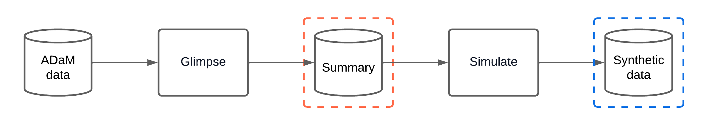

# Getting Started with synadam

## Introduction

`synadam` generates synthetic ADaM (Analysis Data Model) datasets from
real clinical trial data, removing identifiable patient information
while preserving the structure of the original datasets.

**Important:** The synthetic data produced by `synadam` is **not
realistic**. Values are generated to match the structural
characteristics and ranges of the original data but do not preserve
statistical distributions. This package is designed for use cases where
exact values do not matter, such as:

- Testing the generation of clinical tables.
- Validating data processing pipelines.
- Developing and debugging analysis code without access to real patient
  data.

## High-level design

`synadam` uses a two-phase “glimpse-then-simulate” approach:

1.  **Glimpse**: Extract statistical summaries from real data (ranges,
    unique values, NA patterns).
2.  **Simulate**: Generate synthetic data from those summaries.

This provides a clear, traceable interface between real and synthetic
data, allowing users and reviewers to inspect exactly what information
is retained.



## Supported dataset types

| Type | Description | Example |
|----|----|----|
| **ADSL** | Subject-level data (one row per subject) | Demographics, treatment assignments |
| **BDS** | Basic Data Structure (longitudinal) | Lab results (ADLB), vitals (ADVS) |
| **OCCDS** | Occurrence Data Structure (event-based) | Adverse events (ADAE), concomitant meds |
| **TTE** | Time-to-Event (survival analysis) | Overall survival (ADTTE) |

## End-to-end example

This example uses sample data inspired by the [PHUSE CDISC Pilot
Study](https://github.com/phuse-org/phuse-scripts), included in
`inst/extdata/` for demonstration.

``` r

library(synadam)
#> 
#> Attaching package: 'synadam'
#> The following object is masked from 'package:stats':
#> 
#>     simulate
```

### Step 1: Auto-generate a configuration file

Point
[`generate_study_config()`](https://novartis.github.io/synadam/reference/generate_study_config.md)
at a directory containing your `.sas7bdat` files. It scans the files,
infers dataset types and column roles using CDISC conventions, and
writes a draft YAML configuration:

``` r

yaml_path <- synadam::generate_study_config(
  adam_dir = temp_adam_dir,
  output_dir = temp_output_dir,
  seed = 42
)
```

The generated YAML uses heuristics to classify columns into their roles.
Fields with weaker signal are tagged with inline `# REVIEW` comments so
you know what to verify:

``` r

cat(readLines(yaml_path), sep = "\n")
#> # Auto-generated by generate_study_config().
#> # Fields marked REVIEW were inferred with low confidence -
#> # verify them before running simulate_study().
#> 
#> output_dir: "/tmp/RtmpRlLoMo/syn_output"
#> seed: 42
#> 
#> datasets:
#>   adae:
#>     dataset_type: "occds"
#>     path: "/tmp/RtmpRlLoMo/adam_data/adae.sas7bdat"
#>     id_cols: [USUBJID]
#>     seq_col: AESEQ
#>     flag_cols: []
#>     ordered_col_sets:  # REVIEW: X/XN/XL groups detected
#>       - [AESEV, AESEVN]
#> 
#>   adlb:
#>     dataset_type: "bds"
#>     path: "/tmp/RtmpRlLoMo/adam_data/adlb.sas7bdat"
#>     id_cols: [USUBJID]
#>     param_cols: [PARAM, PARAMCD]
#>     visit_cols: [AVISIT, AVISITN]  # REVIEW: visit_cols are optional
#>     flag_cols: [ANL01FL]  # REVIEW: matched *FL pattern
#>     ordered_col_sets:  # REVIEW: X/XN/XL groups detected
#>       - [TRTA, TRTAN]
#> 
#>   adsl:
#>     dataset_type: "adsl"
#>     path: "/tmp/RtmpRlLoMo/adam_data/adsl.sas7bdat"
#>     id_cols: [USUBJID, SUBJID]
#>     treatment_cols: [TRT01A, TRT01AN]
#>     flag_cols: [SAFFL, ITTFL, EFFFL]  # REVIEW: matched *FL pattern
#>     ordered_col_sets:  # REVIEW: X/XN/XL groups detected
#>       - [REGION1, REGION1N]
```

### Step 2: Review and edit the configuration

Before running the simulation, review the generated YAML:

- Verify `dataset_type` is correct for each dataset.
- Check that `treatment_cols`, `flag_cols`, and `ordered_col_sets` are
  appropriate.
- Remove any `flag_cols` you don’t need to preserve.
- Add any `ordered_col_sets` not auto-detected (e.g.,
  `AEBODSYS`/`AEDECOD`).

### Step 3: Simulate the study

Once satisfied with the configuration, generate all synthetic datasets:

``` r

synadam::simulate_study(config_path = yaml_path)
#> ----- Glimpsing adsl (adsl) dataset -----
#> Loading dataset from /tmp/RtmpRlLoMo/adam_data/adsl.sas7bdat
#> Glimpsing treatment/flag columns
#> 2 treatment/flag combination(s) with count = 1 were masked and added to the most common combination.
#> Glimpsing column(s): REGION1, REGION1N
#> Glimpsing column(s): STUDYID
#> Glimpsing column(s): USUBJID
#> Glimpsing column(s): SUBJID
#> Glimpsing column(s): SITEID
#> Glimpsing column(s): AGE
#> Glimpsing column(s): AGEU
#> Glimpsing column(s): SEX
#> Glimpsing column(s): RACE
#> Glimpsing column(s): ETHNIC
#> Glimpsing column(s): COUNTRY
#> Glimpsing column(s): HEIGHTBL
#> Glimpsing column(s): WEIGHTBL
#> Glimpsing column(s): BMIBL
#> Glimpsing column(s): TRTSDT
#> Simulating column(s): treatment, flag
#> Simulating column(s): REGION1, REGION1N
#> Simulating column(s): STUDYID
#> Simulating column(s): USUBJID
#> Simulating column(s): SUBJID
#> Simulating column(s): SITEID
#> Simulating column(s): AGE
#> Simulating column(s): AGEU
#> Simulating column(s): SEX
#> Simulating column(s): RACE
#> Simulating column(s): ETHNIC
#> Simulating column(s): COUNTRY
#> Simulating column(s): HEIGHTBL
#> Simulating column(s): WEIGHTBL
#> Simulating column(s): BMIBL
#> Simulating column(s): TRTSDT
#> ----- Glimpsing adae (occds) dataset -----
#> Loading dataset from /tmp/RtmpRlLoMo/adam_data/adae.sas7bdat
#> Glimpsing occurrence counts, ID and sequence columns
#> Glimpsing ADSL columns from synthetic ADSL
#> Glimpsing column(s): AESEV, AESEVN
#> Glimpsing column(s): AEBODSYS
#> Glimpsing column(s): AEDECOD
#> Glimpsing column(s): AESER
#> Glimpsing column(s): AEREL
#> Glimpsing column(s): ASTDT
#> Glimpsing column(s): AENDT
#> ----- Glimpsing adlb (bds) dataset -----
#> Loading dataset from /tmp/RtmpRlLoMo/adam_data/adlb.sas7bdat
#> Glimpsing PARAM/VISIT columns
#> Glimpsing ADSL columns from synthetic ADSL
#> Glimpsing column(s): TRTA, TRTAN
#> Glimpsing column(s): AVAL
#> Glimpsing column(s): BASE
#> Glimpsing column(s): CHG
#> Glimpsing column(s): ANL01FL
#> Glimpsing column(s): ADT
#> Saving study summary to /tmp/RtmpRlLoMo/file49c5516c0ca1.rds...
#> ----- Simulating adsl -----
#> Simulating column(s): treatment, flag
#> Simulating column(s): REGION1, REGION1N
#> Simulating column(s): STUDYID
#> Simulating column(s): USUBJID
#> Simulating column(s): SUBJID
#> Simulating column(s): SITEID
#> Simulating column(s): AGE
#> Simulating column(s): AGEU
#> Simulating column(s): SEX
#> Simulating column(s): RACE
#> Simulating column(s): ETHNIC
#> Simulating column(s): COUNTRY
#> Simulating column(s): HEIGHTBL
#> Simulating column(s): WEIGHTBL
#> Simulating column(s): BMIBL
#> Simulating column(s): TRTSDT
#> Saving adsl to /tmp/RtmpRlLoMo/syn_output/syn_adsl.rds...
#> ----- Simulating adae -----
#> Simulating occurrence counts
#> Simulating sequence column
#> Simulating column(s): AESEV, AESEVN
#> Simulating column(s): AEBODSYS
#> Simulating column(s): AEDECOD
#> Simulating column(s): AESER
#> Simulating column(s): AEREL
#> Simulating column(s): ASTDT
#> Simulating column(s): AENDT
#> Saving adae to /tmp/RtmpRlLoMo/syn_output/syn_adae.rds...
#> ----- Simulating adlb -----
#> Simulating PARAM/VISIT and ADSL columns
#> Simulating column(s): param, visits
#> Simulating column(s): adsl, cols
#> Simulating column(s): TRTA, TRTAN
#> Simulating column(s): AVAL
#> Simulating column(s): BASE
#> Simulating column(s): CHG
#> Saving adlb to /tmp/RtmpRlLoMo/syn_output/syn_adlb.rds...
```

Synthetic datasets are saved as individual `.rds` files in the output
directory:

``` r

list.files(temp_output_dir, pattern = "\\.rds$")
#> [1] "syn_adae.rds" "syn_adlb.rds" "syn_adsl.rds"

syn_adsl <- readRDS(file.path(temp_output_dir, "syn_adsl.rds"))
head(syn_adsl)
#> # A tibble: 6 × 21
#>   STUDYID    USUBJID SUBJID SITEID TRT01A TRT01AN   AGE AGEU  SEX   RACE  ETHNIC
#>   <chr>      <chr>   <chr>   <dbl> <chr>    <dbl> <dbl> <chr> <chr> <chr> <chr> 
#> 1 CDISCPILO… USUBJI… SUBJI…    704 Place…       0    75 YEARS F     BLAC… HISPA…
#> 2 CDISCPILO… USUBJI… SUBJI…    704 Place…       0    76 YEARS F     BLAC… HISPA…
#> 3 CDISCPILO… USUBJI… SUBJI…    702 Place…       0    61 YEARS F     BLAC… HISPA…
#> 4 CDISCPILO… USUBJI… SUBJI…    703 Xanom…       2    73 YEARS F     BLAC… HISPA…
#> 5 CDISCPILO… USUBJI… SUBJI…    703 Xanom…       2    69 YEARS M     WHITE NOT H…
#> 6 CDISCPILO… USUBJI… SUBJI…    703 Xanom…       2    66 YEARS M     WHITE NOT H…
#> # ℹ 10 more variables: SAFFL <chr>, ITTFL <chr>, EFFFL <chr>, REGION1 <chr>,
#> #   REGION1N <dbl>, COUNTRY <chr>, HEIGHTBL <dbl>, WEIGHTBL <dbl>, BMIBL <dbl>,
#> #   TRTSDT <date>

# Each dataset carries a version attribute for traceability
attr(syn_adsl, "synadam_version")
#> [1] "0.3.0"
```

## Writing the YAML configuration manually

If you prefer full control (or need to fine-tune the auto-generated
draft), author the YAML by hand. The schema supports all four dataset
types:

``` yaml
output_dir: "/path/to/output_directory"
seed: 42

datasets:
  adsl:
    dataset_type: "adsl"
    path: "/path/to/adsl.sas7bdat"
    id_cols: [USUBJID, SUBJID]
    treatment_cols: [TRT01A, TRT01AN]
    flag_cols: [SAFFL, ITTFL, EFFFL]         # Optional
    ordered_col_sets: [[REGION1, REGION1N]]   # Optional

  adlb:
    dataset_type: "bds"
    path: "/path/to/adlb.sas7bdat"
    id_cols: [USUBJID]
    param_cols: [PARAM, PARAMCD]
    visit_cols: [AVISIT, AVISITN]            # Optional
    flag_cols: [ANL01FL]                     # Optional

  adae:
    dataset_type: "occds"
    path: "/path/to/adae.sas7bdat"
    id_cols: [USUBJID]
    seq_col: AESEQ
    ordered_col_sets: [[AEBODSYS, AEDECOD]]  # Optional

  adtte:
    dataset_type: "tte"
    path: "/path/to/adtte.sas7bdat"
    param_cols: [PARAM, PARAMCD]
    censor_cols: [CNSR, EVNTDESC, CNSDTDSC]  # Optional
```

**Note**: Optional fields can be set to `[]` or omitted entirely.

## Granular control: glimpse and simulate individually

For more control, call the `glimpse_*()` and `simulate_*()` functions
directly:

``` r

adsl_data <- synadam::read_sas7bdat(file.path(temp_adam_dir, "adsl.sas7bdat"))

# Glimpse: extract structural summary
adsl_summary <- synadam::glimpse_adsl(
  adsl = adsl_data,
  id_cols = c("USUBJID", "SUBJID"),
  treatment_cols = c("TRT01A", "TRT01AN"),
  flag_cols = c("SAFFL", "ITTFL", "EFFFL"),
  ordered_col_sets = list(c("REGION1", "REGION1N")),
  seed = 42
)
#> Glimpsing treatment/flag columns
#> 2 treatment/flag combination(s) with count = 1 were masked and added to the most common combination.
#> Glimpsing column(s): REGION1, REGION1N
#> Glimpsing column(s): STUDYID
#> Glimpsing column(s): USUBJID
#> Glimpsing column(s): SUBJID
#> Glimpsing column(s): SITEID
#> Glimpsing column(s): AGE
#> Glimpsing column(s): AGEU
#> Glimpsing column(s): SEX
#> Glimpsing column(s): RACE
#> Glimpsing column(s): ETHNIC
#> Glimpsing column(s): COUNTRY
#> Glimpsing column(s): HEIGHTBL
#> Glimpsing column(s): WEIGHTBL
#> Glimpsing column(s): BMIBL
#> Glimpsing column(s): TRTSDT

# Simulate: generate synthetic data
syn_adsl <- synadam::simulate_adsl(adsl_summary, seed = 42)
#> Simulating column(s): treatment, flag
#> Simulating column(s): REGION1, REGION1N
#> Simulating column(s): STUDYID
#> Simulating column(s): USUBJID
#> Simulating column(s): SUBJID
#> Simulating column(s): SITEID
#> Simulating column(s): AGE
#> Simulating column(s): AGEU
#> Simulating column(s): SEX
#> Simulating column(s): RACE
#> Simulating column(s): ETHNIC
#> Simulating column(s): COUNTRY
#> Simulating column(s): HEIGHTBL
#> Simulating column(s): WEIGHTBL
#> Simulating column(s): BMIBL
#> Simulating column(s): TRTSDT
head(syn_adsl)
#> # A tibble: 6 × 21
#>   STUDYID    USUBJID SUBJID SITEID TRT01A TRT01AN   AGE AGEU  SEX   RACE  ETHNIC
#>   <chr>      <chr>   <chr>   <dbl> <chr>    <dbl> <dbl> <chr> <chr> <chr> <chr> 
#> 1 CDISCPILO… USUBJI… SUBJI…    704 Place…       0    75 YEARS F     BLAC… HISPA…
#> 2 CDISCPILO… USUBJI… SUBJI…    704 Place…       0    76 YEARS F     BLAC… HISPA…
#> 3 CDISCPILO… USUBJI… SUBJI…    702 Place…       0    61 YEARS F     BLAC… HISPA…
#> 4 CDISCPILO… USUBJI… SUBJI…    703 Xanom…       2    73 YEARS F     BLAC… HISPA…
#> 5 CDISCPILO… USUBJI… SUBJI…    703 Xanom…       2    69 YEARS M     WHITE NOT H…
#> 6 CDISCPILO… USUBJI… SUBJI…    703 Xanom…       2    66 YEARS M     WHITE NOT H…
#> # ℹ 10 more variables: SAFFL <chr>, ITTFL <chr>, EFFFL <chr>, REGION1 <chr>,
#> #   REGION1N <dbl>, COUNTRY <chr>, HEIGHTBL <dbl>, WEIGHTBL <dbl>, BMIBL <dbl>,
#> #   TRTSDT <date>
```

For BDS, OCCDS, and TTE datasets:

- [`glimpse_bds()`](https://novartis.github.io/synadam/reference/glimpse_bds.md)
  /
  [`simulate_bds()`](https://novartis.github.io/synadam/reference/simulate_bds.md)
  — longitudinal data (ADLB, ADVS)
- [`glimpse_occds()`](https://novartis.github.io/synadam/reference/glimpse_occds.md)
  /
  [`simulate_occds()`](https://novartis.github.io/synadam/reference/simulate_occds.md)
  — occurrence data (ADAE, ADCM)
- [`glimpse_tte()`](https://novartis.github.io/synadam/reference/glimpse_tte.md)
  /
  [`simulate_tte()`](https://novartis.github.io/synadam/reference/simulate_tte.md)
  — time-to-event data (ADTTE)

See
[`?glimpse_bds`](https://novartis.github.io/synadam/reference/glimpse_bds.md),
[`?glimpse_occds`](https://novartis.github.io/synadam/reference/glimpse_occds.md),
[`?glimpse_tte`](https://novartis.github.io/synadam/reference/glimpse_tte.md)
for full documentation.

## Splitting glimpse from simulate

[`simulate_study()`](https://novartis.github.io/synadam/reference/simulate_study.md)
runs both phases in one call. To run them separately — for example, to
glimpse on a machine that has access to the real `.sas7bdat` files and
then simulate elsewhere — use
[`glimpse_study()`](https://novartis.github.io/synadam/reference/glimpse_study.md)
and
[`simulate_study_from_summary()`](https://novartis.github.io/synadam/reference/simulate_study_from_summary.md).

``` r

study_summary_path <- file.path(temp_output_dir, "study_summary.rds")

# Phase 1: glimpse only. Requires the real SAS files.
synadam::glimpse_study(
  config_path        = yaml_path,
  study_summary_path = study_summary_path
)
#> ----- Glimpsing adsl (adsl) dataset -----
#> Loading dataset from /tmp/RtmpRlLoMo/adam_data/adsl.sas7bdat
#> Glimpsing treatment/flag columns
#> 2 treatment/flag combination(s) with count = 1 were masked and added to the most common combination.
#> Glimpsing column(s): REGION1, REGION1N
#> Glimpsing column(s): STUDYID
#> Glimpsing column(s): USUBJID
#> Glimpsing column(s): SUBJID
#> Glimpsing column(s): SITEID
#> Glimpsing column(s): AGE
#> Glimpsing column(s): AGEU
#> Glimpsing column(s): SEX
#> Glimpsing column(s): RACE
#> Glimpsing column(s): ETHNIC
#> Glimpsing column(s): COUNTRY
#> Glimpsing column(s): HEIGHTBL
#> Glimpsing column(s): WEIGHTBL
#> Glimpsing column(s): BMIBL
#> Glimpsing column(s): TRTSDT
#> Simulating column(s): treatment, flag
#> Simulating column(s): REGION1, REGION1N
#> Simulating column(s): STUDYID
#> Simulating column(s): USUBJID
#> Simulating column(s): SUBJID
#> Simulating column(s): SITEID
#> Simulating column(s): AGE
#> Simulating column(s): AGEU
#> Simulating column(s): SEX
#> Simulating column(s): RACE
#> Simulating column(s): ETHNIC
#> Simulating column(s): COUNTRY
#> Simulating column(s): HEIGHTBL
#> Simulating column(s): WEIGHTBL
#> Simulating column(s): BMIBL
#> Simulating column(s): TRTSDT
#> ----- Glimpsing adae (occds) dataset -----
#> Loading dataset from /tmp/RtmpRlLoMo/adam_data/adae.sas7bdat
#> Glimpsing occurrence counts, ID and sequence columns
#> Glimpsing ADSL columns from synthetic ADSL
#> Glimpsing column(s): AESEV, AESEVN
#> Glimpsing column(s): AEBODSYS
#> Glimpsing column(s): AEDECOD
#> Glimpsing column(s): AESER
#> Glimpsing column(s): AEREL
#> Glimpsing column(s): ASTDT
#> Glimpsing column(s): AENDT
#> ----- Glimpsing adlb (bds) dataset -----
#> Loading dataset from /tmp/RtmpRlLoMo/adam_data/adlb.sas7bdat
#> Glimpsing PARAM/VISIT columns
#> Glimpsing ADSL columns from synthetic ADSL
#> Glimpsing column(s): TRTA, TRTAN
#> Glimpsing column(s): AVAL
#> Glimpsing column(s): BASE
#> Glimpsing column(s): CHG
#> Glimpsing column(s): ANL01FL
#> Glimpsing column(s): ADT
#> Saving study summary to /tmp/RtmpRlLoMo/syn_output/study_summary.rds...

# The study summary is one .rds with all summaries plus seed and version.
str(readRDS(study_summary_path), max.level = 2)
#> List of 4
#>  $ summaries      :List of 3
#>   ..$ adsl:List of 16
#>   .. ..- attr(*, "col_order")= chr [1:21] "STUDYID" "USUBJID" "SUBJID" "SITEID" ...
#>   .. ..- attr(*, "output_length")= int 12
#>   .. ..- attr(*, "class")= chr [1:2] "summary_adsl" "summary"
#>   ..$ adae:List of 9
#>   .. ..- attr(*, "col_order")= chr [1:11] "STUDYID" "USUBJID" "AESEQ" "AEBODSYS" ...
#>   .. ..- attr(*, "class")= chr [1:2] "summary_occds" "summary"
#>   ..$ adlb:List of 8
#>   .. ..- attr(*, "col_order")= chr [1:13] "STUDYID" "USUBJID" "PARAM" "PARAMCD" ...
#>   .. ..- attr(*, "class")= chr [1:2] "summary_bds" "summary"
#>  $ seed           : int 42
#>  $ synadam_version: chr "0.3.0"
#>  $ glimpsed_at    : POSIXct[1:1], format: "2026-06-30 10:37:17"

# Phase 2: simulate from the study summary. Does not need the SAS files.
split_output_dir <- file.path(tempdir(), "syn_output_split")
synadam::simulate_study_from_summary(
  study_summary_path = study_summary_path,
  output_dir         = split_output_dir
)
#> ----- Simulating adsl -----
#> Simulating column(s): treatment, flag
#> Simulating column(s): REGION1, REGION1N
#> Simulating column(s): STUDYID
#> Simulating column(s): USUBJID
#> Simulating column(s): SUBJID
#> Simulating column(s): SITEID
#> Simulating column(s): AGE
#> Simulating column(s): AGEU
#> Simulating column(s): SEX
#> Simulating column(s): RACE
#> Simulating column(s): ETHNIC
#> Simulating column(s): COUNTRY
#> Simulating column(s): HEIGHTBL
#> Simulating column(s): WEIGHTBL
#> Simulating column(s): BMIBL
#> Simulating column(s): TRTSDT
#> Saving adsl to /tmp/RtmpRlLoMo/syn_output_split/syn_adsl.rds...
#> ----- Simulating adae -----
#> Simulating occurrence counts
#> Simulating sequence column
#> Simulating column(s): AESEV, AESEVN
#> Simulating column(s): AEBODSYS
#> Simulating column(s): AEDECOD
#> Simulating column(s): AESER
#> Simulating column(s): AEREL
#> Simulating column(s): ASTDT
#> Simulating column(s): AENDT
#> Saving adae to /tmp/RtmpRlLoMo/syn_output_split/syn_adae.rds...
#> ----- Simulating adlb -----
#> Simulating PARAM/VISIT and ADSL columns
#> Simulating column(s): param, visits
#> Simulating column(s): adsl, cols
#> Simulating column(s): TRTA, TRTAN
#> Simulating column(s): AVAL
#> Simulating column(s): BASE
#> Simulating column(s): CHG
#> Saving adlb to /tmp/RtmpRlLoMo/syn_output_split/syn_adlb.rds...

list.files(split_output_dir, pattern = "\\.rds$")
#> [1] "syn_adae.rds" "syn_adlb.rds" "syn_adsl.rds"
```

Pass `seed` to
[`simulate_study_from_summary()`](https://novartis.github.io/synadam/reference/simulate_study_from_summary.md)
to draw a different synthetic replicate from the same summaries; omit it
to reuse the seed stored in the study summary.

## Privacy protection

`synadam` implements multiple privacy mechanisms:

1.  **Structure, not values**: Preserves column names, unique values,
    and ranges, but not distributions or clinical patterns.
2.  **Singleton removal**: Unique values or combinations appearing only
    once are excluded and replaced with more common values.
3.  **NA noise**: 5% of NA positions are randomly flipped to prevent
    exact pattern reproduction.

## Limitations

Synthetic data from `synadam` is **not suitable** for:

- **Realistic simulations** — does not preserve statistical
  distributions.
- **Statistical analysis** — results will not reflect real clinical
  findings.
- **Regulatory submissions** — unless explicitly approved.

## Disclaimer

⚠️ Users are responsible for correctly specifying all column categories
in the configuration. Incorrect configuration can result in private data
leaking into synthetic data.

- **ID columns** (`id_cols`): Must include all subject identifiers.
- **Ordered column sets** (`ordered_col_sets`): Should include the
  minimum sets of related columns required for your use case.

**Always review your configuration carefully and validate that synthetic
data does not contain identifiable information before sharing outside
GxP environments.**
